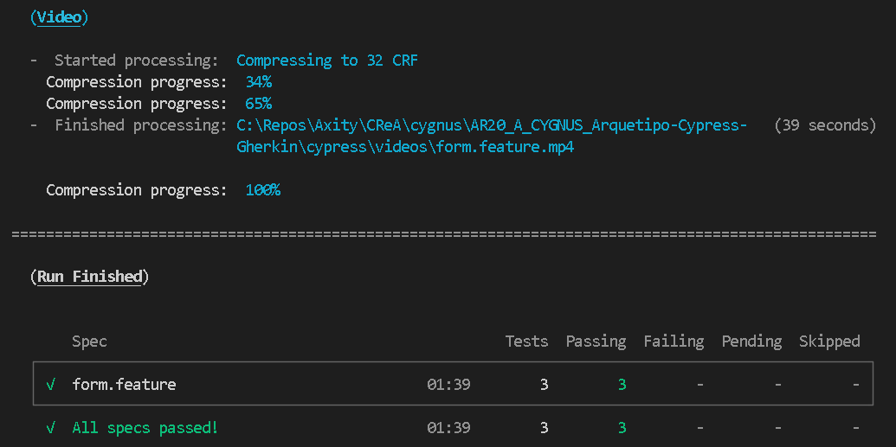
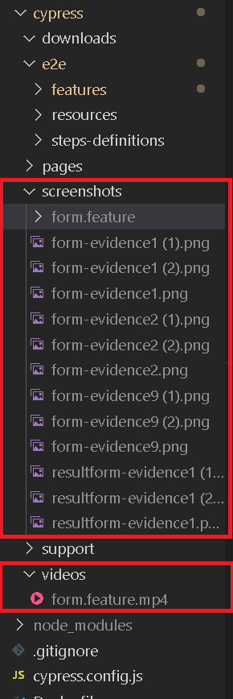
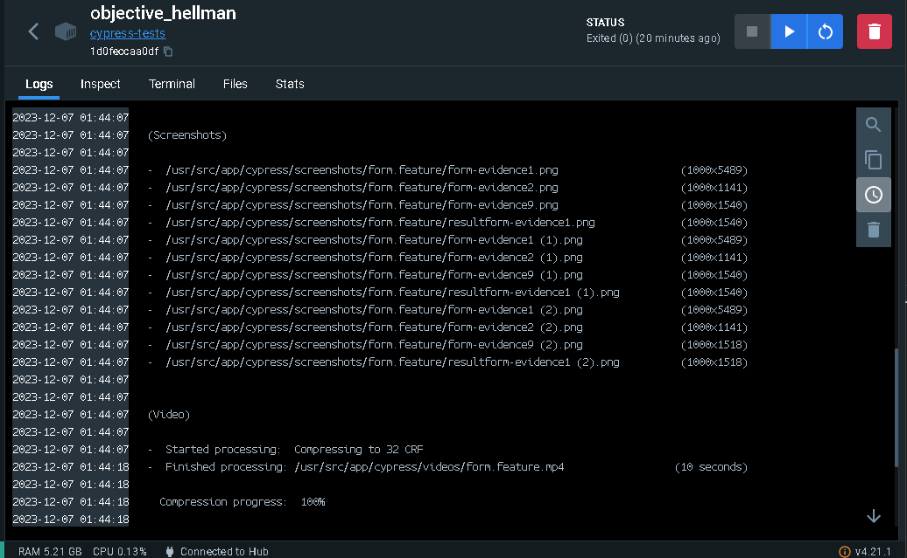
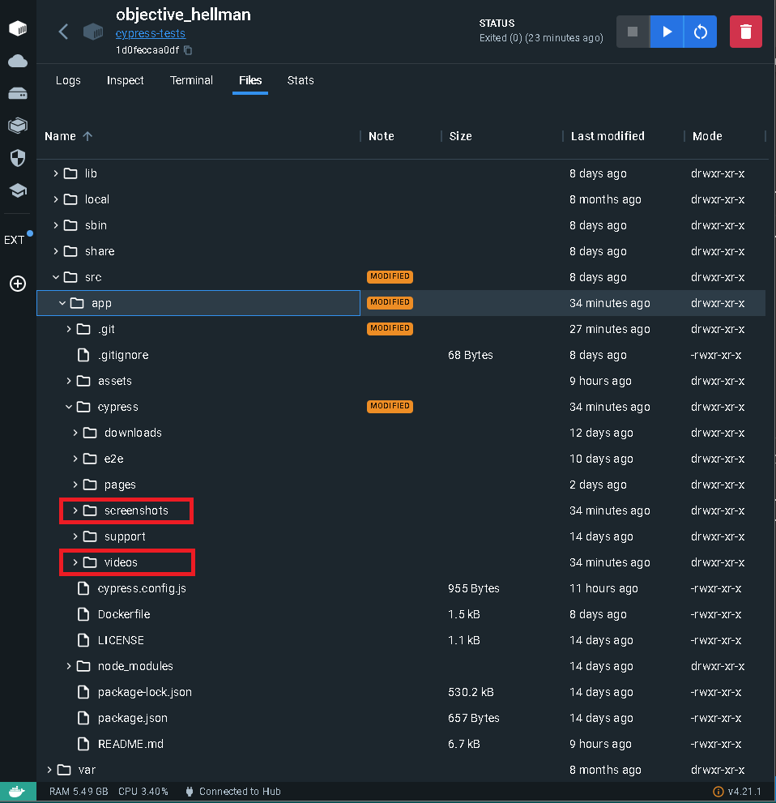

# AR21_A_CYGNUS_Arquetipo-Cypress-Gherkin

Cygnus es un arquetipo generado a modo de servir de base para los desarollos que necesiten una herramienta que les permita escribir pruebas automatizadas de aplicaciones web.

Cygnus aprovecha la sintaxis de Gherkin para describir las pruebas a automatizar .

La solución ensambla Gherkin con Cypress por medio de un preprocesador que permite ejecutar codigo javascript de Cypress orquestado por las definiciones hechas en Gherkin.

## Tecnologias involucradas
 - Cypress

    Una potente herramienta de testing escrita en Javascript, desempeña un papel fundamental en la evaluación de extremo a extremo del rendimiento de software recién desarrollado. En términos sencillos, esta herramienta automatiza la comprobación de que un producto de software cumple con los requisitos iniciales y funciona de manera óptima.

- Gherkin

    El lenguaje Gherkin define la estructura y una sintaxis básica para la descripción de las pruebas que pueden ser entendidas tanto por los integrantes técnicos del equipo como así también por los Analistas/PO o quien quiera que este como representante del cliente. De esta manera mientras se generan pruebas se esta generando documentación viva que describe perfectamente como se comporta el sistema enriqueciendo y manteniendo la documentación.

 - badeball/cypress-cucumber-preprocessor

    Es un paquete de npm que permite utilizar los archivos ".feature" y la estructura de Gherkin como orquestador de las ejecuciones de Cypress y manejar el output de los resultados en diferentes formatos.

## Gherkin
Gherkin utiliza un conjunto de palabras clave especiales para dar estructura y significado a las especificaciones ejecutables. Cada palabra clave se traduce a muchos idiomas hablados; en esta referencia usaremos el inglés :

- FEATURE (CARACTERÍSTICA)
El elemento Feature proporciona el encabezado o el marco para el archivo Feature. Tiene un título y un texto con una descripción de alto nivel de la función de la aplicación que se detalla en el archivo. Contiene el listado de Scenarios que componen el feature, los cuales se pueden agrupar por tags (por ejemplo: @HappyPath)

- SCENARIO (ESCENARIO)
Un Scenario es una lista de pasos que comienza con algunas de estas palabras claves:

    * Given (|Dado|Dada|Dados|Dadas)
    * When (Cuando)
    * Then (Entonces)
    * But (Pero) o And (Y)

## Cypress
Cypress es un framework para automatización de pruebas e2e que permite la ejecucion de pruebas automatizadas de componentes web.

Para Cygnus se dividio la logica de las pruebas en tres archivos escenciales (step definitions, pages y features) que se revisaran a continuación en el apartado de estructura.

### La estructura

Para darle estructura y forma al proyecto y a las pruebas que se necesiten automatizar se generaron tres carpetas escenciales en las cuales se colocan tre tipos de archivos diferentes:

- Features
    - Los archivos ".feature" seran reconocidos por badeball y utilizados para definir los valores de entrada de cada uno de los pasos

- Step definitions
    - Aqui se definen las acciones javascript de Cypress que se ejecutaran por cada step de los feature de gherkin, por lo que hay una mezcla del archivo "feature" y del archivo "pages"

- Pages
    - Se colocan todos los componentes web de una pagina y se codifican las acciones que se pueden llamar desde los step definitions , la mayor parte de este archivo es Javascript siguiendo las reglas de Cypress.

## Ejecutar Manualmente

Para lanzar de manera manual las pruebas de Cypress es necesario tener instalado 

* [node 14+ ](https://nodejs.org/en)

Tambien se requiere de instalar Cypress en la carpeta del proyecto:

    $ cd /your/project/path
    $ npm install cypress --save-dev

Una ves instalados estos dos componentes hay que situarse en la carpeta del proyecto e instalar las dependencias de npm mediante el comando:

    $ npm install

Por ultimo hay dos maneras de lanzar la ejecución manual en un ambiente local como el hasta ahora configurado.

La primera es:
    
    $ npx cypress run

Lo que lanzara la ejecución sin abrir cypress en modo grafico y ejecutara las pruebas en segundo plano.

Si lanzamos el proyecto actual de esa manera veremos lo siguiente:

Seguido de las ejecuciones y los resultados.

Una vez que se mostraron los resultados veremos tambien la lista de evidencias generadas y sus rutas correspondientes.

---
La otra forma de ejecución manual es atravez del cliente de Cypress que instalamos , para eso solo hay que situarse en la carpeta raiz del proyecto y ejecutar desde una terminal el siguiente comando:

        $ .\node_modules\.bin\Cypress open

Una vez que ejecutemos ese comando veremos la consola de Cypress abierta.

Seleccionamos la opción de pruebas e2e lo que nos mostrara una pantalla con las opciones de los navegadores instalados en el equipo compatibles con las pruebas.

Seleccionaremos un navegador de los disponibles, daremos clic en START E2E TESTING  y nos abrira el navegador seleccionado con el ambiente de pruebas listo para que seleccionemos el o los features que estan disponibles para ejecutarse.

En nuestro caso veremos el feature de form listo para ser ejecutado y al darle clic se lanzara la ejecución automatizada de todos los casos definidos en nuestro archivo gherkin.feature

Al final de la ejecución veremos un resumen de los features ejecutados.

## Ejecutar con Docker

Para ejecutar las pruebas que tengamos codificadas desde un contenedor solo es necesario que sigamos los siguientes pasos:

* Construir la imagen del contenedor por medio del dockerfile , para eso hay que abrir una terminal en la raiz de nuetro proyecto (donde se encuentra el Dockerfile).

        $ cd /your/project/path

* Luego de abrir dicha terminal ejecutar el comando 

        $ docker build -t cypress-tests .

    

* Una vez que la imagen fue generada solo es cuestion de correr una instancia de la imagen para que las pruebas se ejecuten  por medio del comando :

        $ docker run cypress-tests

    

## Como obtener las evidencias 

Para obtener las evidencias de la ejecución de las pruebas automatizadas dependera del metodo de ejecución que utilizamos.

* Ejecución manual (Sin interfaz grafica)

    Retomando este ejemplo , veremos que al final de la ejecución nos coloca la ruta del video y screenshots tomados durante la ejecución.

    

* Ejecución manual (Con interfaz grafica)

    Hablando de este ejemplo especifico , nos creara las evidencias en la carpeta de nuetro proyecto en dos carpetas , una para los videos y otra para los screenshots

    

* Ejecución automatica (por medio de docker)

    Para obtener las evidencias de ejecución generadas por medio de un contenedor , sera necesario acceder al container y buscar en la carpeta "/usr/src/app" los resultados que nos indica el output de la ejecución

    

    

## Licencia

[MIT](https://opensource.org/licenses/MIT)

### Este ARTE forma parte del CReA de Axity, para más información visitar [CReA](https://intellego365.sharepoint.com/sites/CentralAxity/M%C3%A9xico/Consultoria/Arquitectura/SitePages/CReA.aspx)

